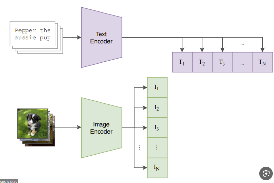
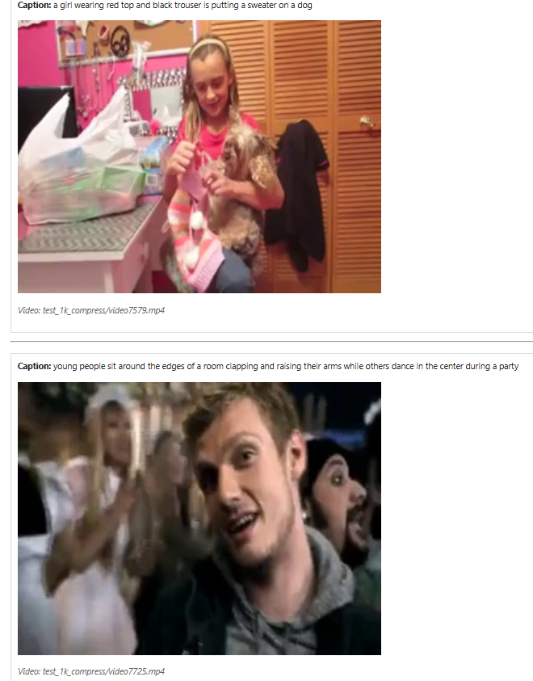
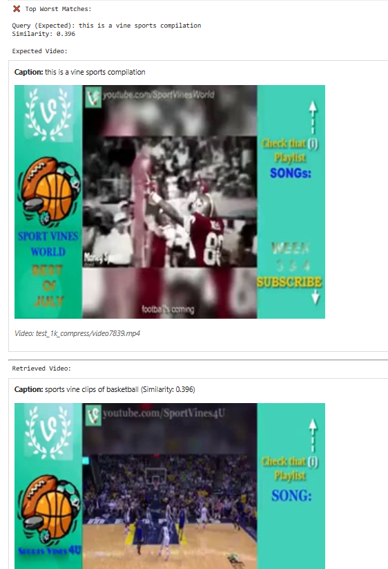
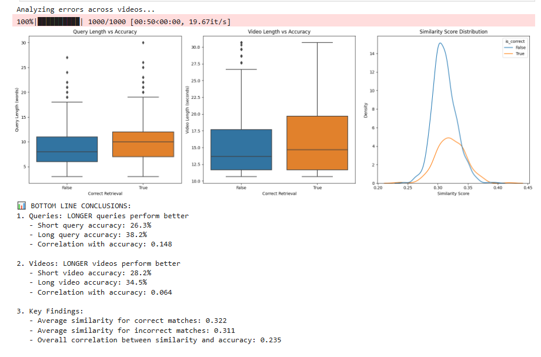
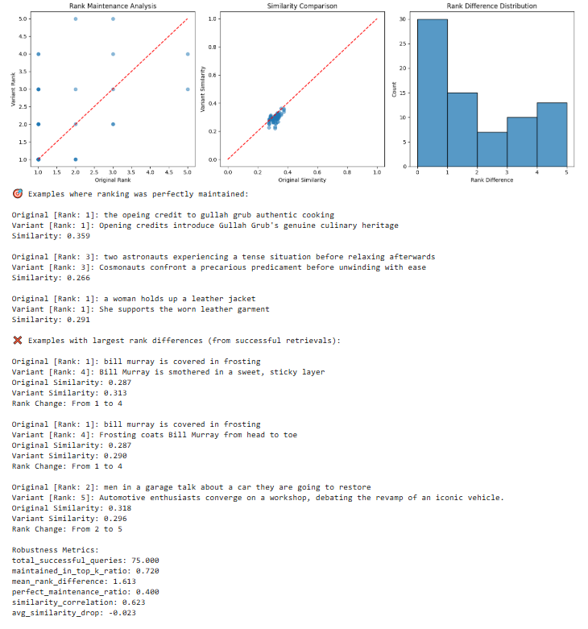
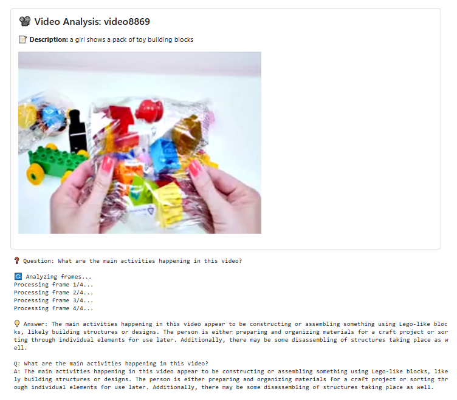
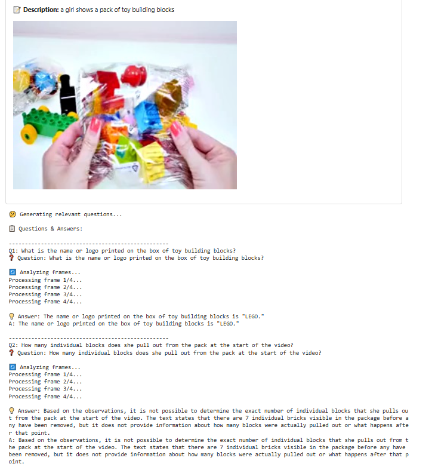

# Video Understanding Suite: Search & QA 🎥 

A comprehensive system for video search and question answering using state-of-the-art multimodal AI.

## 🎯 Key Features

- **Video Search**: Semantic search using CLIP embeddings
- **Video Q&A**: Natural language interaction using LLaVA
- **Auto Question Generation**: Smart question generation based on video content
- **Visual Context**: Display of videos alongside analysis
- **Multimodal Understanding**: Integration of visual and textual information

## 💻 Notebooks

### 1. Video Search ([Videos_Search.ipynb](Videos_Search.ipynb)) 🔍

#### CLIP Architecture


CLIP (Contrastive Language-Image Pre-training) is trained on millions of (image, text) pairs from the internet. During training, it learns to:
* Encode images and text into the same embedding space
* Maximize similarity between matching image-text pairs
* Minimize similarity between non-matching pairs
* Create robust and generalizable visual-textual representations

#### System Architecture


**System Components** 🛠️

*Video Processing (Offline)*
* Extract 8 evenly spaced frames from each video
* Each frame passes through CLIP's Vision Transformer (ViT) encoder
* Get 512-dimensional embedding for each frame
* Average the frame embeddings to get a single video representation
* Store embeddings in index for fast retrieval

*Text Processing (Online)*
* Take the search query (e.g., "cooking pasta")
* Pass through CLIP's text encoder (transformer-based)
* Get a 512-dimensional text embedding

*Similarity Matching*
* Calculate cosine similarity between the text embedding and all video embeddings
* Cosine similarity measures the angle between vectors: closer to 1 means more similar
* Rank videos by similarity scores
* Return top-k most similar videos

**Key Features**
* Both video and text are mapped to the same 512-dimensional space
* CLIP was trained on millions of image-text pairs to align visual and textual features
* Mean pooling of frames captures the overall video content
* Cosine similarity is scale-invariant, focusing on directional similarity
* The system can find relevant videos even with different phrasing due to CLIP's robust text understanding

#### Search Example 📝
```python
# Initialize system
video_dataset = VideoDataset(df)

# Search example
video_dataset.search("a person cooking in the kitchen", top_k=5)
```


#### Evaluation Results 📊

**Evaluation of Video Search System**

To evaluate our video retrieval system, we test it on random queries from our dataset. The evaluation process:
* Randomly sample 100 video descriptions as test queries
* For each query:
    - Use the original video description as search query
    - Check if the system retrieves the correct video in top-k results
    - Measure the similarity score and ranking position

The metrics include:
- top1_accuracy: Percentage of queries where correct video is the first result
- top5_accuracy: Percentage of queries where correct video is in top 5 results
- top10_accuracy: Percentage of queries where correct video is in top 10 results
- mean_similarity: Average similarity score across all queries
- median_rank: Median position of correct video in results

This provides a quantitative assessment of our system's retrieval performance. Higher accuracy scores and lower median rank indicate better search quality.

```
Metrics:
top1_accuracy: 0.260
top5_accuracy: 0.470
top10_accuracy: 0.590
mean_similarity: 0.312
median_rank: 2.000
```

#### Error Analysis 🔍


**Analysis of Best and Worst Matches**

To better understand our system's strengths and weaknesses, we analyze the extreme cases - both successful and failed retrievals:

Best Matches (num_examples=5)
- Cases where the correct video was retrieved with highest similarity scores
- Shows pairs of queries and videos where CLIP embeddings work exceptionally well
- Helps identify what types of content and descriptions are most reliably matched
    
Worst Matches (num_examples=5)
- Cases where either:
    * The wrong video was retrieved with high confidence
    * The correct video was ranked much lower despite similar content
- For each case, displays:
    * Original query and expected video
    * Retrieved video and its similarity score
    * The rank difference and similarity scores

This analysis helps us:
- Identify patterns in successful matches
- Understand types of queries that confuse the system
- Find potential improvements for handling challenging cases
- Better understand CLIP's strengths and limitations in video search

#### Detailed Analysis


**Comprehensive Analysis**

Analysis of how different characteristics affect search performance:

Query Analysis
- Studies relationship between query length and search accuracy
- Determines if shorter/longer descriptions lead to better results
- Measures correlation between query characteristics and success rate

Video Analysis
- Examines impact of video length on retrieval accuracy
- Looks for patterns in successful vs. unsuccessful retrievals
- Helps understand if longer/shorter videos are harder to match

The report provides:
- Statistical correlations between characteristics and accuracy
- Clear conclusions about what works better (shorter vs. longer content)
- Accuracy percentages for different content categories
- Similarity score distributions for successful and failed matches

Bottom Line Metrics:
- Query length impact (correlation with accuracy)
- Video length impact (correlation with accuracy)
- Average similarity scores for correct vs. incorrect matches
- Overall trends in how content characteristics affect performance

#### Robustness Testing 💪


**Robustness Evaluation using Query Variations**

Testing how well our system handles different ways of describing the same video content:

Process:
- Sample 50 videos from dataset
- For each video's description:
    * Generate 3 alternative descriptions using LLM
    * Keep same meaning but vary word choice and structure
    * Run search with each variation
    * Compare results across original and variant queries
    
We Measure:
- If correct video stays in top-k results across variations
- How much ranking position changes
- Changes in similarity scores
- Consistency of results

Key Metrics:
- maintained_in_top_k_ratio: How often video stays in top results
- mean_rank_difference: Average change in ranking position
- perfect_maintenance_ratio: How often exact rank is preserved
- similarity_correlation: Consistency of similarity scores
- avg_similarity_drop: How much scores typically change

### 2. Video Question Answering ([Video_QA.ipynb](Video_QA.ipynb)) 💬

Our VideoQASystem leverages LLaVA, a state-of-the-art open-source multimodal model that combines vision and language understanding. While LLaVA was originally designed for single-image multimodal interactions, we extend its capabilities to video analysis through sequential frame processing. The system demonstrates how open-source multimodal AI can understand both visual content and natural language queries to enable intelligent video analysis.

#### System Architecture 🏗️

*Video Processing*
* Extracts key frames uniformly (4 frames by default)
* Processes each frame through LLaVA's multimodal encoder
* Combines insights from multiple frames
* Shows video alongside answers

#### Example Usage 🎯

The answer_question function takes a video ID and a question as input. It first displays the video and its original description. Then it extracts 4 key frames from the video, which are processed sequentially through LLaVA, a multimodal AI model. For each frame, LLaVA analyzes the visual content in context of the question and provides insights. Finally, these frame-by-frame insights are combined to generate a comprehensive answer that considers information from all parts of the video.

*Direct Question Answering*
```python
video_qa = VideoQASystem(data)
video_id = "video8869"
question = "What are the main activities happening in this video?"
answer = video_qa.answer_question(video_id, question)
```


*Automatic Analysis*

The analyze_video_with_questions function automatically processes a video in two steps: First, it uses the video's text description to generate relevant questions using an LLM (Llama-3). Then, for each generated question, it performs visual analysis using LLaVA to provide answers, displaying the video and its description alongside the Q&A results. This creates a comprehensive analysis of the video content through automatically generated and answered questions.

```python
video_qa.analyze_video_with_questions(video_id)
```


## 🚀 Future Improvements & Roadmap

### 🔍 Enhanced Search System

**Video Understanding**
* Domain-specific CLIP fine-tuning for specialized video collections
* Advanced temporal modeling ([VIOLET](https://arxiv.org/abs/2111.12681), [All-in-one](https://arxiv.org/abs/2203.07303), [VideoMAE](https://arxiv.org/abs/2203.12602))
* Smart content detection using [DINO v2](https://arxiv.org/abs/2304.07193) for scene understanding
* Efficient data partitioning and indexing

**System Performance**
* Vector database integration ([FAISS](https://github.com/facebookresearch/faiss), [Milvus](https://milvus.io/))
* Confidence-based result filtering
* Optimized batch processing
* Intelligent caching system

### 💡 Enhanced Q&A System

**Advanced Model Integration**
* [MiniGPT4-video](https://vision-cair.github.io/MiniGPT4-video/) Integration
    - End-to-end video understanding
    - Enhanced temporal coherence
    - Extended context window support

* Rich Visual Understanding
    - DINO-v2 object & action detection
    - Scene change detection
    - Temporal segmentation

**Interactive Features**
* Conversational Capabilities
    - Multi-turn dialogue
    - Context preservation
    - Follow-up questions

* Temporal Navigation
    - Timestamp-specific queries
    - Scene-based navigation
    - Time-aware responses

* Enhanced Visualization
    - Object detection overlays
    - Action highlighting
    - Visual attention maps

* Cross-Video Analysis
    - Scene comparison
    - Multi-video questions
    - Content relationship mapping

## 🔧 Installation

```bash
pip install torch clip opencv-python pillow requests numpy pandas
```

## 🤝 Dependencies

- Python 3.8+
- PyTorch 2.0+
- OpenCV
- CLIP
- LLaVA (via Ollama)

## 📚 References

- [LLaVA Project](https://llava-vl.github.io/)
- [CLIP Paper](https://arxiv.org/abs/2103.00020)
- [MiniGPT4-video](https://vision-cair.github.io/MiniGPT4-video/)
